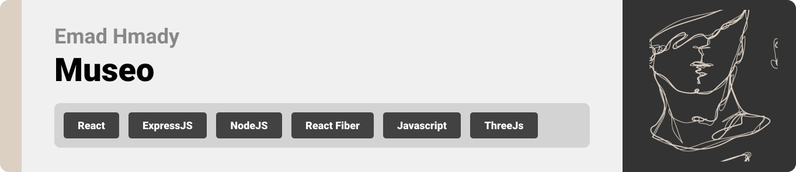
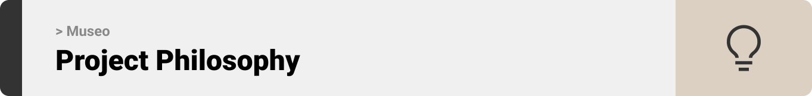
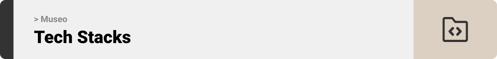
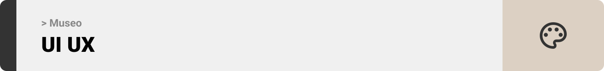
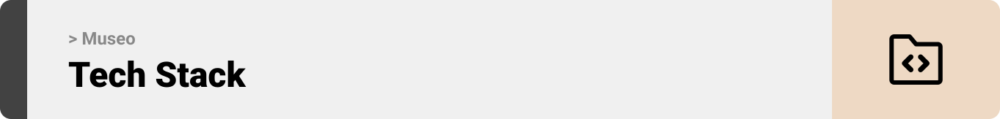
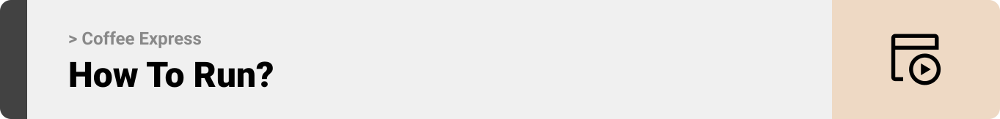
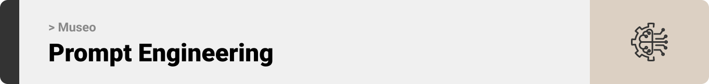
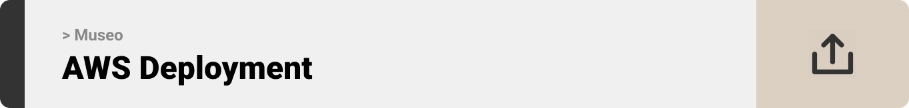
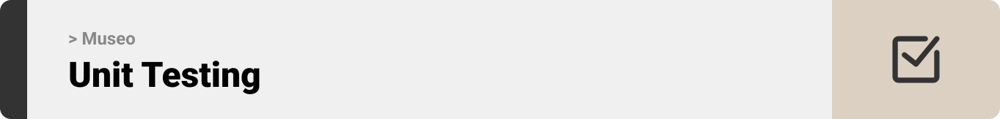

<br><br>

<!-- project philosophy -->


> A website that aims to provide users with a three-dimensional, unique and interactive ways to explore and appreciate artifacts.

### User Stories

Admin:

- As an admin, I want to have an overview of the servers and the clients that are currently connected.

- As an admin, I want to check the details of each socket instance, the details of each room, and the details of every event emitted or received by the server.

- As an admin, I want to receive feedback from users and mark them as resolved.

User:

- As a user, I want to browse through a variety of 3D artifacts and know more about each one without interruptions or distractions.

- As a user, I desire a shared artifact browsing experience including instant chat with family and friends, each with a character in the tour.

- As a user, I want to delve into the evolution of human innovations, interact with them, and view them from all angles.

<br><br>

<!-- Tech Stacks -->


### Museo is built using the following technologies:

- This project uses [React-three-fiber](https://docs.pmnd.rs/react-three-fiber/getting-started/introduction) which is a React renderer for [ThreeJs](https://threejs.org/docs/). ThreeJs is a cross-browser JavaScript library and application programming interface (API) used to create and display animated 3D computer graphics in a web browser using WebGL.
- For persistent storage (database), the website uses [MongoDb](https://www.mongodb.com/) which is a cross-platform, document-oriented database that uses a JSON-like format to store documents.
- For real-time messaging and movement, the website uses [Socket.io](https://socket.io/). Socket.io is an event-driven library for real-time web applications. It enables real-time, bi-directional communication between web clients and servers.
- The app uses the font ["Kavoon"](https://fonts.google.com/specimen/Kavoon) as its main font, and the design of the app adheres to the material design guidelines.

> We designed Coffee Express using wireframes and mockups, iterating on the design until we reached the ideal layout for easy navigation and a seamless user experience.

### Wireframes

| Login screen                            | Register screen                       | Landing screen                        |
| --------------------------------------- | ------------------------------------- | ------------------------------------- |
|  |  |  |

### Mockups

| Home screen                             | Menu Screen                           | Order Screen                          |
| --------------------------------------- | ------------------------------------- | ------------------------------------- |
|  |  |  |

<br><br>

<!-- UI/UX -->


> Using the wireframes and mockups as a guide, we implemented the Coffee Express app with the following features:

### User Screens (Mobile)

| Login screen                              | Register screen                         | Landing screen                          | Loading screen                          |
| ----------------------------------------- | --------------------------------------- | --------------------------------------- | --------------------------------------- |
|  |  |  |  |
| Home screen                               | Menu Screen                             | Order Screen                            | Checkout Screen                         |
|  |  |  |  |

### Admin Screens (Web)

| Login screen                            | Register screen                       | Landing screen                        |
| --------------------------------------- | ------------------------------------- | ------------------------------------- |
|  |  |  |
| Home screen                             | Menu Screen                           | Order Screen                          |
|  |  |  |

<br><br>

<!-- Database Design -->


### Coffee Express is built using the following technologies:

- This project uses the [Flutter app development framework](https://flutter.dev/). Flutter is a cross-platform hybrid app development platform which allows us to use a single codebase for apps on mobile, desktop, and the web.
- For persistent storage (database), the app uses the [Hive](https://hivedb.dev/) package which allows the app to create a custom storage schema and save it to a local database.
- To send local push notifications, the app uses the [flutter_local_notifications](https://pub.dev/packages/flutter_local_notifications) package which supports Android, iOS, and macOS.
  - 🚨 Currently, notifications aren't working on macOS. This is a known issue that we are working to resolve!
- The app uses the font ["Work Sans"](https://fonts.google.com/specimen/Work+Sans) as its main font, and the design of the app adheres to the material design guidelines.

<br><br>

<!-- Implementation -->


> To set up Coffee Express locally, follow these steps:

### Prerequisites

This is an example of how to list things you need to use the software and how to install them.

- npm
  ```sh
  npm install npm@latest -g
  ```

### Installation

_Below is an example of how you can instruct your audience on installing and setting up your app. This template doesn't rely on any external dependencies or services._

1. Get a free API Key at [https://example.com](https://example.com)
2. Clone the repo
   ```sh
   git clone https://github.com/your_username_/Project-Name.git
   ```
3. Install NPM packages
   ```sh
   npm install
   ```
4. Enter your API in `config.js`
   ```js
   const API_KEY = "ENTER YOUR API";
   ```

Now, you should be able to run Coffee Express locally and explore its features.

<!-- Prompt Engineering -->

<!-- AWS Deployment -->

<!-- Unit Testing -->

<!-- How to Run -->

