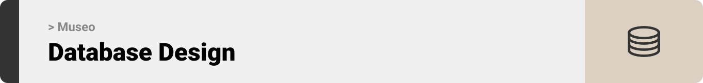
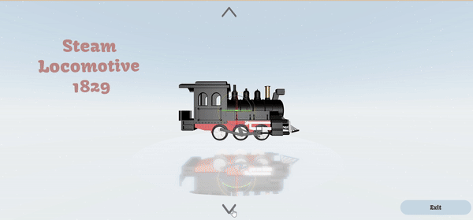
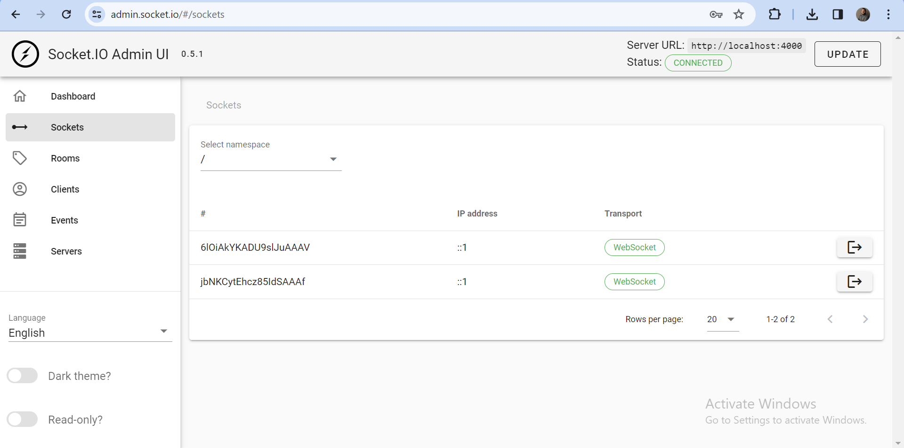
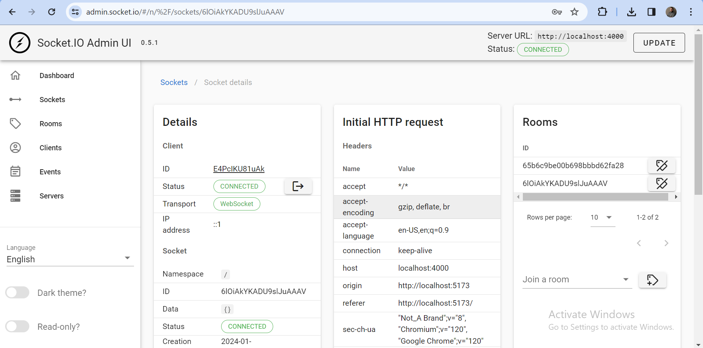
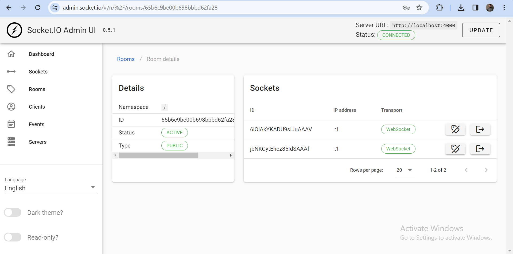
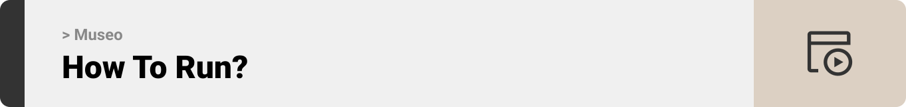

<br><br>

<!-- project philosophy -->


> A website that aims to provide users with a three-dimensional, unique and interactive ways to explore and appreciate artifacts.

### User Stories

Admin:

- As an admin, I want to have an overview of the servers and the clients that are currently connected.
- As an admin, I want to check the details of each socket instance, the details of each room, and the details of every event emitted or received by the server.
- As an admin, I want to receive feedback from users and mark them as resolved.

User:

- As a user, I want to browse through a variety of 3D artifacts and know more about each one without interruptions or distractions.
- As a user, I desire a shared artifact browsing experience including instant chat with family and friends, each with a character in the tour.
- As a user, I want to delve into the evolution of human innovations, interact with them, and view them from all angles.

<br><br>

<!-- Tech Stacks -->


### Museo is built using the following technologies:

- This project uses [React-three-fiber](https://docs.pmnd.rs/react-three-fiber/getting-started/introduction) which is a React renderer for [ThreeJs](https://threejs.org/docs/). ThreeJs is a cross-browser JavaScript library and application programming interface (API) used to create and display animated 3D computer graphics in a web browser using WebGL.
- For persistent storage (database), the website uses [MongoDb](https://www.mongodb.com/) which is a cross-platform, document-oriented database that uses a JSON-like format to store documents.
- For real-time messaging and movement, the website uses [Socket.io](https://socket.io/). Socket.io is an event-driven library for real-time web applications. It enables real-time, bi-directional communication between web clients and servers.
- The website uses the font ["Kavoon"](https://fonts.google.com/specimen/Kavoon) as its main font, and the design of the app adheres to the material design guidelines.

<br><br>

<!-- UI/UX -->


> We designed Museo using wireframes and mockups, iterating on the design until we reached the ideal layout for easy navigation and a seamless user experience.

- Project Figma design [figma](https://www.figma.com/file/D1ah8vUMAvImz9FAW7y3wc/Museo?type=design&t=PzdPzF7ZU5f5jKX9-6)

### Mockups

| Home screen                                        | Login Screen                                   | Register Screen                                    |
| -------------------------------------------------- | ---------------------------------------------- | -------------------------------------------------- |
|  |  |  |

| Options screen                                     | Tours Screen                                        | Popup screen                               | Time Travel screen                                         |
| -------------------------------------------------- | --------------------------------------------------- | ------------------------------------------ | ---------------------------------------------------------- |
|  |  |  |  |

<br><br>

<!-- Database Design -->


### Architecting Data Excellence: Innovative Database Design Strategies:

- Insert ER Diagram here

<br><br>

<!-- Implementation -->


### User Screens (Web)

| Login screen                                         |
| ---------------------------------------------------- |
|  |

| Solo Tour Screen                                   |
| -------------------------------------------------- |
|  |

| Group Tour Screen                                    |
| ---------------------------------------------------- |
|  |

| Chat Screen                                        |
| -------------------------------------------------- |
|  |

| Time Travel screen                                               |
| ---------------------------------------------------------------- |
|  |

### Admin Screens (Web)

| Dashboard screen                                        | Sockets screen                                                | Socket Detials screen                                             |
| ------------------------------------------------------- | ------------------------------------------------------------- | ----------------------------------------------------------------- |
|  |            |  |
| Rooms screen                                            | Room Details Screen                                           | Events Screen                                                     |
|          |  |                  |

<br><br>

<!-- Prompt Engineering -->

<br><br>
<!-- AWS Deployment -->

<br><br>
<!-- Unit Testing -->

<br><br>
<!-- How to Run -->


> To set up Museo locally, follow these steps:

### Prerequisites

This is an example of how to list things you need to use the software and how to install them.

- npm
  ```sh
  npm install npm@latest -g
  ```

### Installation

_Below is an example of how you can instruct your audience on installing and setting up your app. This template doesn't rely on any external dependencies or services._

1.  Clone the repo git clone [github](https://github.com/emadhmadyy/Museo-Magical-Journey.git)

> cd backend

2. Install NPM packages
   ```sh
   npm install
   ```
3. Change `.env.example` file name that is inside backend folder and make it `.env`
4. Enter your MongoDb connection string followed by a new database name in `.env`
   ```sh
   MONGODB_URL= "MongoDb_connection_string/Database_name";
   ```
5. Enter your secret key in `.env`

   ```sh
   SECRET_KEY= "ENTER SECRET KEY";
   ```

> cd frontend

6. Install NPM packages
   ```sh
   npm install
   ```
7. Change `.env.example` file name that is inside frontend folder and make it `.env`
8. Enter backend base url in `.env`
   ```sh
   VITE_BASE_URL = "ENTER URL";
   ```

Now, you should be able to run Museo locally and explore its features.
